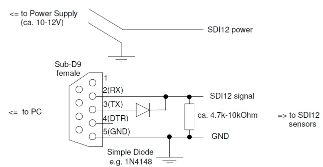

# SDI12Term
_A simple SDI12 Terminal Console for Windows._
 
SDI12 is a very simple serial protocol (public domain), used widely for (slow) meteorological and hydrological sensors since 1988.
Data are transmitted in a human readable format (but may also secured with a CRC16) and a lot of sensors exist on the market. With SDI12 it is very easy to build (small) complex systems, like wheather stations or water quality monitoring stations.

This simple and free tool can be used for easy setup of an SDI12 bus.

## Example for commands: (using a pressure/temperature sensor): 
Each sensor has an own address (normally '0' - '9', where '?' is broadcast):

```
'?I!'    Identifies a sensor (using broadcast address). 
         Reply might be '513STS AG  4900001.51157252<CR><LF>' 
         (Sensor's address is '5', rest are sensor infos, e.g. how to 
         interprete the values, protocol version, ...) 
         (Problem: if there are more than 1 sensor (or sensors share unintentially
         the same address, reply will be corrupted, then each address must be scanned
         by its own address or the SDI12 bus must be reconfigured)
         
'5I!'    Identifies sensor with address '5'. Reply might be (the same 
         as before) '513STS AG  4900001.51157252<CR><LF>'
         
'5M!'    Starts a measure on sensor '5'. Reply might 
         be: '50012<CR><LF>' (Sensor '5' has 2 values in 001 seconds)
         
'5D0!'   Asks for the measure. Result is '5+0.00180+26.15<CR><LF>' 
         ('5' is address, values are 0.0018 bar and 26.15 °C)
```

This software can communicate with SDI12 sensors, only a RS232-UART (as still present on most PCs) is required,
a connector (called SUB-D9), a cheap diode (like 1N4148) and a resistor (in the range 5-10 kOhm). And of course power for the sensors.
The software was compiled and tested with the free Microsoft Visual Code Studio (VS) and the free Embarcadero C++ Studio Communinty Edition.

*CRC Check: If SDI12Term detects a CRC in a command it will check it. Commands with CRC are more reliable, but simply less good readable to humans...

## Installation ##
- Simply copy the "./Release/SDI12Term.exe" (compiled with VS) to your PC (and optionally add it in PATH).
- SDI12Term.exe will try to use COM1: by default or scan for available COM ports and display a list.
- Alternatively you can compile SDI12Term.exe by your own.
 
## A very simple adapter: ##


### A small and incomplete list of SDI12 sensor suppliers (tested with this software): ###
- STS AG (pressure sensors): https://www.stssensors.com/products/gp-sts-level/pp-sts-level-ptm/ptm_n_sdi12-programmable-pressure-transmitter-sdi-12
- TerraTransfer GmbH (hydrological sensors, environment sensors, cloud based data loggers): https://www.terratransfer.org/
- GeoPrecision GmbH (patended soil moisture sensor (matric potential)): https://www.plantsensor.de/
- DeltaT (volumetric soil moisture): https://delta-t.co.uk/an-introduction-to-sdi-12/
- ...

## Links ##
- The SDI-12 Support Group: https://www.sdi-12.org
- Wikipedia: https://en.wikipedia.org/wiki/SDI-12


***
