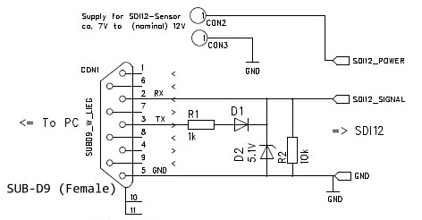

# SDI12Term
 A simple SDI12 Terminal Console for Windows
 
SDI12 is a very simple serial protocol (public domain), used widely for (slow) meteorological and hydrological sensors since 1988.
Data are transmitted in a human readable format and a lot of sensors exist on the market.

## Example for commands: (using a pressure/temperature sensor): 
Each sensor has an own address (normally '0' - '9', where '?' is broadcast):
- '?I!'  identifies a sensor (unknown address). Reply might be '513STS AG  4900001.51157252<CR><LF>' (Sensor's address is '5', rest are sensor infos)
- '5I!'  identifies sensor with address '5'. Reply might be '513STS AG  4900001.51157252<CR><LF>'
- '5M!'  start a measure on sensor '5'. Reply might be: '50012<CR><LF>' (Sensor '5' has 2 Values in 001 seconds)
- '5D0!'  asks for the measure. Result is '5+0.00180+26.15<CR><LF>' ('5' is address, Values are 0.0018 bar and 26.15 °C)

This simple and free tool can communicate with SDI12 sensors, only a RS232-UART (as still present on most PCs) is required,
a connector (called SUB-D9), a cheap diode (like 1N4148) and a resistor (in the range 5-10 kOhm). And of course power for the sensors.

A very simple adapter ;-)

Link to the SDI-12 Support Group: https://www.sdi-12.org
 
Wikipedia: https://en.wikipedia.org/wiki/SDI-12

***
